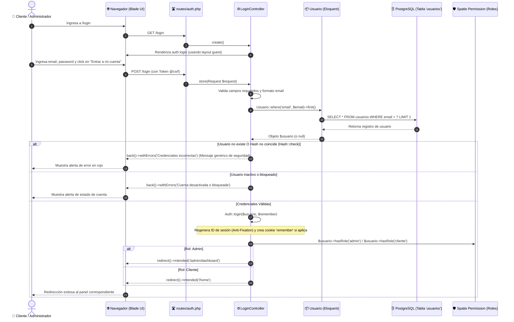

# 🔐 Arquitectura de Autenticación y Flujo de Login - PayMe Panamá

Este documento explica de forma detallada cómo se comunican la **interfaz visual (Diseño Blade)** y la **lógica del backend (Controladores, Modelos y Base de Datos)** en el módulo de inicio de sesión y autenticación del proyecto **eCommerce PyME Panamá**.

---

## 🗺️ 1. Diagrama del Flujo de Comunicación (End-to-End)



---

## 🎨 2. Componentes del Diseño y su Implementación

| Elemento de Diseño Requerido | Implementación en Blade (`resources/views/auth/login.blade.php`) | Función / Comportamiento |
| :--- | :--- | :--- |
| **1. Logo o nombre arriba** | `<x-application-logo :boxed="true" class="mb-2.5" />` | Carga el logo vectorial oficial de PayMe o `public/images/logo.png` con caja estilizada. |
| **2. Campo Correo Electrónico** | `<input type="email" name="email" id="email" required autofocus ...>` con ícono `mail` | Valida formato de email en HTML5 y Blade, mantiene valor anterior con `old('email')`. |
| **3. Campo Contraseña** | `<input type="password" name="password" id="password" ...>` con botón toggle de visibilidad | Oculto por defecto (`type="password"`). El botón con icono `visibility_off` alterna a texto plano vía JavaScript. |
| **4. Checkbox "Recordarme"** | `<input type="checkbox" name="remember" id="remember" ...>` | Envía valor booleano (`true`/`false`) al controlador para activar cookie persistente. |
| **5. Enlace "¿Olvidaste tu contraseña?"** | `<a href="{{ route('password.request') }}">` | Redirige al flujo de recuperación de clave (`/forgot-password`). |
| **6. Botón "Entrar a mi cuenta"** | `<button type="submit" id="submit-login-btn">` | Envía el formulario vía `POST /login` con estilos interactivos y micro-animación. |
| **7. Enlace "¿No tienes cuenta? Regístrate"** | `<a href="{{ route('register') }}">` | Redirige al formulario de creación de cuenta (`/register`). |
| **8. Mensaje de error visible** | `@if ($errors->any())` con `#error-alert` | Muestra contenedor de alerta estilizado con borde rojo si las credenciales fallan. |

---

## ⚙️ 3. Lógica del Backend: Paso a Paso

### A. Recepción y Protección de la Solicitud
1. **Protección CSRF (`@csrf`)**:  
   El formulario incluye un token de seguridad generado por Laravel para prevenir ataques de falsificación de peticiones en sitios cruzados.
2. **Control de Intentos (Rate Limiting)**:  
   Laravel protege la ruta contra ataques de fuerza bruta limitando intentos consecutivos.

### B. Validación de Datos en `LoginController.php`
El controlador ejecuta:
```php
$request->validate([
    'email' => ['required', 'string', 'email'],
    'password' => ['required', 'string'],
]);
```

### C. Autenticación contra la tabla `usuarios` y `password_hash`
Dado que la tabla del proyecto es `usuarios` y la contraseña se almacena en la columna `password_hash`:
```php
$usuario = Usuario::where('email', $request->email)->first();

if (!$usuario || !Hash::check($request->password, $usuario->password_hash)) {
    // MENSAJE DE SEGURIDAD GENÉRICO: No revela si falló el email o la contraseña
    return back()->withErrors([
        'email' => 'Las credenciales proporcionadas no coinciden con nuestros registros.',
    ])->onlyInput('email');
}
```

### D. Verificación de Estado de la Cuenta
Antes de otorgar acceso, se valida si el usuario está activo o bloqueado en la base de datos:
```php
if (!$usuario->activo || $usuario->bloqueado) {
    return back()->withErrors([
        'email' => 'Tu cuenta ha sido desactivada o bloqueada. Contacta al soporte.',
    ]);
}
```

### E. Inicio de Sesión y Token "Recordarme"
```php
Auth::login($usuario, $remember);
$request->session()->regenerate();
```
- Si `$remember` es `true`, Laravel emite una cookie segura con un token persistente `remember_token` guardado en la tabla `usuarios`.
- `$request->session()->regenerate()` previene ataques de fijación de sesión (*Session Fixation*).

### F. Redirección Basada en Roles (Spatie `laravel-permission`)
El modelo `Usuario` utiliza el trait `HasRoles`. El controlador decide a dónde enviar al usuario:
```php
if ($usuario->hasRole('admin') || $usuario->hasRole('super-admin')) {
    return redirect()->intended('/admin/dashboard');
}

return redirect()->intended('/home');
```

---

## 📁 4. Archivos que Intervienen en este Módulo

| Archivo | Ubicación | Responsabilidad |
| :--- | :--- | :--- |
| **Layout Base** | [resources/views/layouts/guest.blade.php](file:///c:/Users/Proyectos/ecommerce-pyme-panama/resources/views/layouts/guest.blade.php) | Plantilla limpia sin sidebars, carga tipografía estándar **Figtree**, estilos Tailwind y soporte glassmorphism. |
| **Componente Logo** | [resources/views/components/application-logo.blade.php](file:///c:/Users/Proyectos/ecommerce-pyme-panama/resources/views/components/application-logo.blade.php) | Componente reutilizable (`<x-application-logo />`) con fallback a `public/images/logo.png` o vector PayMe. |
| **Vista de Login** | [resources/views/auth/login.blade.php](file:///c:/Users/Proyectos/ecommerce-pyme-panama/resources/views/auth/login.blade.php) | Formulario de autenticación con directivas `@csrf`, `@error`, enlaces y script de mostrar/ocultar contraseña. |
| **Controlador Login** | [app/Http/Controllers/Auth/LoginController.php](file:///c:/Users/Proyectos/ecommerce-pyme-panama/app/Http/Controllers/Auth/LoginController.php) | Valida entradas, verifica hash contra `usuarios`, maneja intentos, inicia sesión y redirige por rol. |
| **Modelo Usuario** | [app/Models/Usuario.php](file:///c:/Users/Proyectos/ecommerce-pyme-panama/app/Models/Usuario.php) | Implementa `Authenticatable`, trait `HasRoles` de Spatie, define tabla `usuarios` y método `getAuthPassword()`. |
| **Rutas Web y Auth** | [routes/auth.php](file:///c:/Users/Proyectos/ecommerce-pyme-panama/routes/auth.php) y [routes/web.php](file:///c:/Users/Proyectos/ecommerce-pyme-panama/routes/web.php) | Mapea las rutas `GET /login`, `POST /login` y `POST /logout`. |
| **Configuración Auth** | [config/auth.php](file:///c:/Users/Proyectos/ecommerce-pyme-panama/config/auth.php) | Configura el provider `usuarios` apuntando a `App\Models\Usuario::class`. |
| **Configuración Permisos** | [config/permission.php](file:///c:/Users/Proyectos/ecommerce-pyme-panama/config/permission.php) | Mapea las tablas de roles y permisos en español (`roles`, `permisos`, `usuario_roles`, `usuario_permisos`). |

---

## 🔒 5. Buenas Prácticas de Seguridad Implementadas

1. **Mensaje de Error Neutro**:  
   Si las credenciales no coinciden, se muestra un mensaje genérico para no filtrar a atacantes si un correo existe o no en la base de datos.
2. **Cifrado de Contraseñas**:  
   Uso de `Hash::check()` compatible con algoritmos seguros (`Bcrypt`/`Argon2id`).
3. **Regeneración de Sesión**:  
   Se invalida el ID de sesión anterior al autenticarse para evitar secuestro de sesión.
4. **Protección CSRF**:  
   Validación estricta de token en todas las peticiones `POST`.
